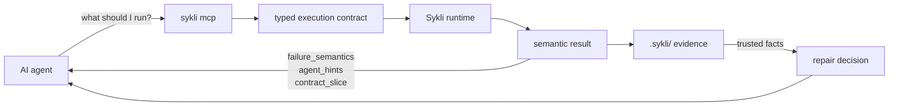

# sykli

Execution contracts for agent work.

Sykli is the contract layer between AI agents and the work they execute.

Agents can edit code, propose fixes, and adapt plans. They still need a
reliable answer to basic questions:

- What work exists in this repo?
- What should run for this change?
- What does success mean?
- Why did a run fail?
- Can retry help?
- What evidence can another tool trust afterward?

Sykli answers those questions with typed execution contracts and structured
evidence instead of terminal soup.

Agents should not regex CI logs. Sykli gives them typed failures, contract
slices, retry hints, and evidence.

Think of it the way musical notation changed music. Before notation, music
was oral tradition — it drifted with every retelling and died with its
performers. Notation separated the work from the performance: the same score,
played by anyone, and every performance verifiable against the page. Software
work in the agent era has the same problem — everyone is shipping better
performers; almost nobody is writing better scores. Sykli is the score: the
contract is written before execution, pinned and hashed, and it decides —
mechanically — whether a performance counts. The performer can be Claude,
Codex, a human, or a shell script. The contract does not care. That is the
point.

## About

Sykli is an agent-readable execution layer for software work. It lets projects
define build, test, deploy, review, and approval work as typed graphs; runs
those graphs locally or in CI; and returns structured evidence that agents,
reviewers, and downstream systems can trust.

Short version for the repo sidebar:

```text
The contract layer between AI agents and the work they execute.
```

## The Sykli Loop

```text
plan -> contract -> run -> semantic failure -> evidence -> repair
```

1. The repo defines an execution graph in Go, Rust, TypeScript, Elixir, or
   Python.
2. The SDK emits a canonical JSON contract governed by versioned schemas.
3. Sykli validates the graph, schedules the work, and records structured
   results.
4. Agents consume typed failure semantics, agent hints, contract slices, and
   `.sykli/` evidence instead of scraping logs.

The point is not to make agentic work perfectly deterministic. The point is to
make the contract around it deterministic enough to inspect, verify, replay,
and hand to another tool.


```mermaid
flowchart LR
    agent["AI agent"]
    mcp["sykli mcp"]
    contract["typed execution contract"]
    runtime["Sykli runtime"]
    result["semantic result"]
    evidence[".sykli/ evidence"]
    repair["repair decision"]

    agent -->|"what should I run?"| mcp
    mcp --> contract
    contract --> runtime
    runtime --> result
    result -->|"failure_semantics\nagent_hints\ncontract_slice"| agent
    result --> evidence
    evidence -->|"trusted facts"| repair
    repair --> agent
```

## A Tiny Contract

```go
package main

import sykli "github.com/false-systems/sykli-elixir/sdk/go"

func main() {
    s := sykli.New()

    s.Task("test").
        Run("go test ./...").
        TaskType(sykli.TaskTypeTest).
        Inputs("**/*.go").
        SuccessCriteria(sykli.ExitCode(0))

    s.Task("build").
        Run("go build -o app").
        TaskType(sykli.TaskTypeBuild).
        After("test").
        Output("binary", "app").
        SuccessCriteria(
            sykli.ExitCode(0),
            sykli.FileExists("app"),
        )

    s.Emit()
}
```

```text
sykli · pipeline.go                                local · 0.7.0

  ●  test     go test ./...                        108ms
  ●  build    go build -o app                      612ms

  ─  2 passed                                      720ms
```

That program is not the product. The emitted contract is. Sykli validates it,
runs it, and records evidence about what happened.

## The Contract Is Pinned

`sykli lock` writes `sykli.lock`: the canonical contract plus its
`sha256:` hash, committed next to your pipeline. From then on, every
`sykli validate` and `sykli run` checks the emitted contract against the
lock — changing what "done" means is a visible, reviewable act, never a
silent one.

```bash
sykli lock                # pin the current contract edition
sykli run                 # refuses if the contract drifted from sykli.lock
sykli contract            # render the contract for human review
sykli contract --diff     # classify changes against the lock
```

Two properties fall out of the lock that YAML pipelines cannot offer:

- **Nondeterministic pipelines are rejected.** `sykli lock` and
  `sykli validate` emit the pipeline twice; if the two emissions hash
  differently (a timestamp, a random value, unsorted map iteration), the
  contract is refused with `contract.nondeterministic`. A contract you
  cannot reproduce is not a contract.
- **Weakening is detected, not just change.** `sykli contract --diff`
  classifies every change by direction — *neutral* (command changed, task
  added), *strengthening* (criterion added, gate added), or *weakening*
  (success criterion removed, evidence requirement dropped, criticality
  lowered, gate deleted) — and exits non-zero when weakening is present.
  "This diff makes the checks weaker" becomes something CI can gate on and
  a reviewer can see in one line.

```text
Contract diff sha256:2f41… -> sha256:9c07…

Weakening
  - test: success_criteria entry removed (success_criteria)

Verdict: weakening present
```

## When It Fails, Agents Read Facts — Not Logs

Every terminal result carries a typed classification. An agent consuming
`sykli run --json` (or `sykli report --json`, or the MCP server) sees this for
a task whose command succeeded but whose declared `success_criteria` did not:

```json
{
  "name": "test",
  "status": "failed",
  "failure_semantics": {
    "class": "criteria_failure",
    "retryable": false,
    "source": "criteria",
    "reason": "success_criteria_failed",
    "message": "task 'test' failed success_criteria",
    "details": {
      "code": "success_criteria_failed",
      "task": "test",
      "step": "run"
    }
  },
  "agent_hints": {
    "retry_may_help": false,
    "inspect_target": false,
    "inspect_contract": true,
    "inspect_dependencies": false,
    "requires_human_decision": false,
    "unknown_failure_class": false
  },
  "contract_slice": {
    "name": "test",
    "task_type": "test",
    "success_criteria": [
      {
        "type": "exit_code",
        "equals": 0
      }
    ]
  }
}
```

The agent branches on `class` — `runtime_failure`, `criteria_failure`,
`timeout`, `dependency_failure`, `policy_block`, `missing_evidence`, and
friends — instead of regexing log text. `agent_hints` says which follow-up
paths are semantically valid; it is deliberately not a diagnosis engine.
Results also carry a `contract_slice`: the declared task semantics that
governed the outcome, so a tool can see *which contract* failed without
re-parsing the pipeline.

`sykli fix` renders the same facts with source context for AI-assisted repair,
and `sykli mcp` serves them to agents directly. See
[`docs/failure-semantics.md`](docs/failure-semantics.md) and
[`docs/agent-readable-failure-output.md`](docs/agent-readable-failure-output.md).

## MCP: The Agent Interface

`sykli mcp` exposes the execution graph and run evidence as tools an agent can
call:

```text
agent -> suggest_tests      # what should I run for this change?
agent -> run_pipeline       # run the graph or selected tasks
agent -> get_failure        # what failed, semantically?
agent -> run_fix            # correlate failure facts with source context
agent -> get_history        # is this flaky or newly broken?
```

That gives an AI coding agent a loop it can actually reason over:

```text
change code -> ask what to run -> run it -> inspect typed failure -> repair -> rerun
```

MCP is the transport. Sykli's value is the contract and evidence behind the
tools: typed graph data, coded errors, failure semantics, agent hints, and
contract slices.

## Mandates: Bounded Authority for Agents

Wire-format version `"5"` adds two fields that make agent tasks first-class
contract citizens: `actor` (who performs the work — `human`, `agent`, or
`service`) and `mandate` (the authority granted to that actor, in advance,
with explicit limits).

```json
{
  "name": "fix-flaky-test",
  "command": "claude -p 'fix the flaky test'",
  "task_type": "test",
  "actor": { "kind": "agent", "id": "claude" },
  "mandate": {
    "scope": ["core/test/**"],
    "budget": { "diff_lines": 200, "wall_clock_ms": 900000 },
    "capabilities": { "network": false }
  },
  "success_criteria": [ ... ],
  "evidence_required": [ ... ]
}
```

The rule is hard, not advisory: **an agent task without a mandate,
success criteria, and required evidence is a schema error** — every SDK
refuses to emit it and the engine refuses to parse it. Freedom must be
declared. Where a performer may improvise, the contract says so, says
within what limits, and says what proof is due when the freedom ends.

Violations are typed like everything else: work outside `scope` or beyond
`budget` fails with `policy_block` semantics naming the exceeded dimension;
a mandate the target cannot enforce fails explicitly with
`unsupported_target` rather than pretending. An agent's own claim of success
is never the record — the engine classifies the outcome against the declared
contract, and every mandated task records a `mandate_outcome`
(`kept` / `violated` / `unverified` / `unsupported`) in run history.

After the fact, `sykli audit <run-id>` judges any recorded run: does its
contract hash match the current `sykli.lock`, were declared success
criteria and evidence actually recorded, does every agent task have a
mandate outcome? The verdict is computed at read time — re-pinning a
different contract flips old runs to fail, because an audit is a judgment
over evidence, not a frozen fact.

This is deliberately *not* a behavioral policy engine: a mandate is a
per-run, deterministic contract field. Cross-run behavioral judgment about
actors belongs to a separate layer (see
[`docs/vartio-integration.md`](docs/vartio-integration.md)).

## Evidence That Survives The Session

Every run writes structured evidence under `.sykli/`:

```text
.sykli/
├── occurrence.json       # latest terminal FALSE Protocol occurrence
├── occurrences_json/     # archived JSON occurrences
├── occurrences/          # archived ETF occurrences
├── runs/                 # run history manifests
├── context.json          # pipeline and health context from `sykli context`
├── work/items/           # local work item state
├── gates/                # local gate decision state
└── outbox/               # deferred Team Mode sync payloads
```

An agent session can end. The evidence remains. Another agent, reviewer, CI
wrapper, or audit tool can read the same structured facts without replaying
the terminal.

The detailed on-disk schema is documented in
[`docs/false-protocol-schema.md`](docs/false-protocol-schema.md).

## The Workbench: One Screen For One Repo

```bash
sykli gui
```

A local-first control room served on `127.0.0.1` — no auth, no cloud, no
analytics, embedded in the binary. One screen answers: what was declared
(the contract), what ran (the graph), who moved the work forward (humans,
agents, daemons), what failed and why (typed failure classes), what
evidence exists, and who may unblock the next step (gates).

It is a *view over the evidence*, not a second system: the contract comes
from `sykli.lock`, runs from `.sykli/runs/`, and approving a gate in the
browser writes the same artifact `sykli gate approve` does. The Workbench
never executes repo code, and evidence rows show the same read-time audit
verdict `sykli audit` prints. Details in
[`docs/workbench.md`](docs/workbench.md).

## Product Pillars

1. **Contract.** A graph is not YAML. A graph is a typed, versioned contract.
2. **Execution.** The contract runs locally, in containers, in CI, or on
   distributed targets as those surfaces mature.
3. **Failure semantics.** Agents get `runtime_failure`, `criteria_failure`,
   `timeout`, `dependency_failure`, `policy_block`, and other typed classes.
4. **Evidence.** Every run leaves structured facts that downstream tools can
   inspect.
5. **Authority.** Agent tasks carry mandates — scope, budget, and
   capabilities granted in advance. Freedom is declared in the contract,
   never assumed.

## Sykli Is Not CI

Sykli is not a CI system in the narrow sense. It is a compiler and runtime for
execution graphs.

Builds, tests, deployments, release checks, reviews, security analysis,
approvals, and agent-driven reasoning can all be represented as nodes in the
same graph. CI is the first obvious use case because CI already has the right
primitives: tasks, dependencies, inputs, outputs, and execution order.

The shift is that the pipeline is no longer hidden inside vendor YAML and shell
scripts. It becomes a typed program that emits an explicit execution contract.

## How It Works

1. **Author.** Write the graph in Go, Rust, TypeScript, Elixir, or Python.
2. **Emit.** The SDK emits canonical JSON governed by
   [`schemas/sykli-pipeline.schema.json`](schemas/sykli-pipeline.schema.json).
3. **Validate.** The engine rejects malformed contracts, unsupported versions,
   cycles, invalid dependencies, and incompatible fields.
4. **Execute.** The BEAM engine schedules graph levels, supervises tasks,
   applies runtime selection, and records structured results.
5. **Observe.** Terminal events become FALSE Protocol occurrences and run
   artifacts under `.sykli/`.

The same contract can be read by the engine, agents, MCP tools, CI wrappers,
auditors, and release tooling without scraping logs.

## Wire Format

Wire-format versions are explicit, not advisory:

| Version | Meaning |
|---------|---------|
| `"1"` | Baseline task graph |
| `"2"` | Resources, containers, mounts, and cache metadata |
| `"3"` | Agent-native semantic fields such as `task_type` and `success_criteria` |
| `"4"` | Required evidence references via `evidence_required` |
| `"5"` | Performer identity and bounded authority via `actor` and `mandate` |

SDKs auto-detect the minimum version from the features used. The engine rejects
missing, empty, malformed, and unsupported versions. `task_type` and
`success_criteria` require version `"3"` or newer; `evidence_required` requires
version `"4"`; `actor` and `mandate` require version `"5"`. See
[`docs/sdk-schema.md`](docs/sdk-schema.md) for the field contract.

## Why BEAM Matters

Sykli uses BEAM because execution graphs are naturally concurrent, supervised,
distributed, and failure-heavy.

BEAM gives the engine:

- Lightweight processes for graph nodes, watchers, services, and coordinators.
- Supervision trees for structured failures instead of process-wide crashes.
- Message passing instead of shared mutable state.
- Distribution primitives for mesh execution.
- Fault isolation between tasks, runtimes, agents, and background services.
- Long-running daemon support for local, remote, and CI-triggered work.

BEAM is an architectural choice: the runtime has the same shape as the problem.

## Distributed, With Deterministic Boundaries

Sykli can run locally, in containers, on Kubernetes, or across a BEAM mesh.
Local execution and container execution are stable. Mesh execution and the
Kubernetes target are beta.

- **Mesh execution.** `sykli daemon start` keeps a BEAM node running.
  Capability labels such as `gpu` can be used for placement, and `--mesh`
  opts into distributed execution.
- **Deterministic boundaries.** Time, randomness, and transport are kept behind
  controllable boundaries where the engine owns them. The repo includes a
  `NoWallClock` Credo check to keep raw wall-clock and random calls out of
  deterministic engine paths.
- **Retry semantics.** Tasks run under supervision. Failures become structured
  task results, and retry/fail/skip behavior follows the task contract.

This is not a claim that all distributed or agent work becomes deterministic.
The contract boundary is what Sykli makes inspectable.

## Team Mode

> The daemon executes and records; the mesh dispatches inside trusted
> networks; the coordinator synchronizes team state across locations;
> `.sykli/` remains the local source of detailed evidence.

Sykli has four coordination shapes
([`docs/coordination-modes.md`](docs/coordination-modes.md)):

1. **Local-only.** No network. One machine. The default — and binding:
   everything below is opt-in and nothing requires it.
2. **Trusted LAN mesh.** BEAM distribution inside one trust domain.
3. **Self-hosted coordinator.** A team-state plane you run yourself
   (`sykli coordinator start`). Daemons connect outbound over HTTPS; the
   coordinator never executes work and never owns detailed evidence.
4. **Hybrid.** Mesh inside trust domains, coordinator across them.

What works today:

```bash
export SYKLI_COORDINATOR_TOKEN=...           # admin bootstrap token
sykli coordinator start --port 8400          # the team-state plane
sykli coordinator mint-token --org o --team t --role approver
sykli daemon join --coordinator URL --org o --team t --stay
sykli work create "fix flaky test" --team t  # shared work items
sykli gate approve <id> --reason "Reviewed" --team t   # delivered by heartbeat
sykli daemon leave                           # clean session teardown
```

A daemon joined with `--stay` heartbeats the coordinator, publishes
metadata-only run summaries and waiting gates, and receives gate decisions
back — a reviewer's approval on one machine unblocks a waiting gate on
another within one heartbeat interval. The black-box suite proves this
round-trip against the built binary on every change (`COORD-006`).

The security posture is deliberate: signed per-team tokens scope every
coordinator read and write; bearer tokens are refused over plaintext to
non-loopback hosts; daemons never accept remote work without an explicit
`--accept-remote-work`; and no logs, source, artifacts, or secrets cross
the boundary — references and summaries only. See
[`docs/team-mode-security.md`](docs/team-mode-security.md).

## Agentic Review As Code

Review nodes are experimental.

A review node is a structured review step in the graph. It is not a shell task,
and it does not call Codex, Claude, or other LLM providers directly. It gives
future agent and tool runners a controlled, inspectable shape for review work.

Builders exist in all five SDKs and are covered by cross-SDK conformance. Review
nodes have a separate schema surface from task nodes; the schema rejects task
execution fields such as `command`, `outputs`, `services`, `mounts`, `k8s`,
`retry`, `timeout`, `task_type`, `success_criteria`, and `evidence_required` on
review nodes.

```go
s.Review("review:api_breakage").
    Primitive("api_breakage").
    Agent("local").
    Diff("main...HEAD").
    Context("README.md", "docs/sdk-schema.md").
    After("test")
```

Current review support includes graph modeling, schema validation, SDK builders,
runtime dispatch for deterministic primitives, and a structured `review_result`
shape. The default `api_breakage` primitive boundary returns an explicit
unsupported result until a real adapter is configured. LLM provider calls,
prompt templates, and broader review primitive implementations are not bundled.

Planned primitive areas include security boundaries, API breakage, behavior
regression, test coverage gaps, and architecture boundary checks.

## Use Cases

| Use case | What Sykli gives you |
|----------|----------------------|
| Agentic workflows | Agents are executors under mandates; the graph defines what runs, what the agent may touch, and what evidence proves it |
| PR reviews | Experimental review nodes with constrained context and explicit primitive semantics |
| Release checks | SLSA v1.0 provenance attestations and structured run evidence |
| Security validation | Secret-scoped tasks, OIDC token exchange, and webhook hardening in the core engine |
| Human-in-the-loop approvals | Team Mode gates: an agent's run blocks on a gate, a reviewer approves from another machine, the heartbeat delivers the decision |
| Infrastructure validation | The same graph can target local execution, containers, Kubernetes, or a BEAM mesh |
| CI pipelines | The CI graph as code, with cache keys, dependency-level parallelism, and structured results |

## Design Principles

- **Real languages, not DSLs.** Pipelines are Go, Rust, TypeScript, Elixir, or
  Python programs.
- **Explicit dependencies.** The DAG is the source of truth.
- **Typed APIs.** SDKs are checked by their host language and cross-SDK
  conformance tests.
- **Portable execution.** One graph can run locally, in containers, on
  Kubernetes, or across a mesh.
- **Local-first.** Network features are additive.
- **No YAML-first.** YAML can be a projection; it is not the source of truth.
- **Agents are executors, not magic.** A review primitive is a constrained graph
  node.
- **Determinism is a boundary.** Sykli constrains nondeterminism with typed
  contracts and structured evidence.

## Install

```bash
curl -fsSL https://raw.githubusercontent.com/false-systems/sykli-elixir/main/install.sh | bash
```

For the current release candidate, install the matching CLI explicitly:

```bash
curl -fsSL https://raw.githubusercontent.com/false-systems/sykli-elixir/main/install.sh | bash -s v0.9.0-rc.1
```

Or [download a binary](https://github.com/false-systems/sykli-elixir/releases/latest) for
macOS or Linux. Release candidates (e.g. `v0.9.0-rc.1`) are published as
GitHub prereleases — they appear on the
[releases page](https://github.com/false-systems/sykli-elixir/releases) but never
as `latest`, and are not pushed to package registries.

Using Sykli inside GitHub Actions is supported as a hosted fallback. The
local-first GitHub path is [`docs/github-native.md`](docs/github-native.md):
GitHub sends webhooks to a node you control, and Sykli runs the graph there.

<details>
<summary>Build from source</summary>

```bash
git clone https://github.com/false-systems/sykli-elixir.git
cd sykli/core
mix deps.get
mix escript.build
sudo mv sykli /usr/local/bin/
```

Requires Elixir 1.14+.
</details>

## Pick Your SDK

| Language | Install | Default file |
|----------|---------|--------------|
| Go | `go get github.com/false-systems/sykli-elixir/sdk/go@latest` | `sykli.go` |
| Rust | `sykli = "0.7.0"` in `Cargo.toml` | `sykli.rs` |
| TypeScript | `npm install sykli@0.7.0` | `sykli.ts` |
| Elixir | `{:sykli_sdk, "~> 0.7.0"}` in `mix.exs` | `sykli.exs` |
| Python | `pip install sykli==0.7.0` | `sykli.py` |

The Go module is live today. Registry packages for the other SDKs are
catching up to 0.7.0 — until your registry shows it, every SDK is usable
directly from `sdk/<lang>/` in this repository at the `v0.7.0` tag.

All SDKs emit the same canonical contract shape.

## Capabilities

```go
// Content-addressed cache
s.Task("test").Run("go test ./...").Inputs("**/*.go", "go.mod")

// Containers and cache mounts
s.Task("build").
    Container("golang:1.22").
    Mount(s.Dir("."), "/src").
    MountCache(s.Cache("go-mod"), "/go/pkg/mod").
    Workdir("/src").
    Run("go build -o app")

// Matrix expansion
s.Task("test").Run("go test ./...").Matrix("go", "1.21", "1.22", "1.23")

// Gates
s.Gate("approve-deploy").Message("Deploy?").Strategy("prompt")
s.Task("deploy").Run("./deploy.sh").After("approve-deploy")

// Artifact passing
s.Task("build").Run("go build -o /out/app").Output("binary", "/out/app")
s.Task("deploy").InputFrom("build", "binary", "/app/bin").Run("./deploy.sh /app/bin")

// Capability-based placement
s.Task("train").Requires("gpu").Run("python train.py")

// Conditional execution and secrets
s.Task("deploy").Run("./deploy.sh").When("branch == 'main'").Secret("DEPLOY_TOKEN")
```

These examples use existing Go SDK APIs covered by SDK tests and conformance
fixtures.

## CLI

```bash
sykli                     # run pipeline in the current project
sykli run                 # explicit run command
sykli --filter=test       # run matching tasks
sykli --timeout=5m        # per-task timeout
sykli --mesh              # opt into mesh execution
sykli --target=k8s        # run through the Kubernetes target
sykli --runtime=podman    # select runtime

sykli init                # generate SDK file
sykli lock                # pin the contract edition to sykli.lock
sykli contract            # render the contract for review
sykli contract --diff     # classify contract changes; exit 1 on weakening
sykli validate            # validate graph without running
sykli plan                # dry-run execution plan
sykli delta               # run tasks affected by git changes
sykli watch               # re-run on file changes
sykli explain             # show last run as an AI-readable report
sykli fix                 # failure analysis with source context
sykli audit <run-id>      # judge a recorded run against the current lock
sykli gui                 # local Workbench (127.0.0.1); --demo for fake data
sykli context             # write .sykli/context.json
sykli query               # query pipeline, history, and health data
sykli graph               # Mermaid or DOT graph
sykli verify              # cross-platform verification via mesh
sykli history             # recent runs
sykli report              # last run summary

sykli work list           # local work items
sykli run --work <id>     # associate a run with a work item
sykli work runs <id>      # runs associated with a work item
sykli gates list          # local gate decisions
sykli gate approve <id> --reason "Reviewed"
sykli cache stats         # cache statistics

sykli coordinator start   # self-hosted Team Mode coordinator
sykli daemon join --stay  # join a coordinator, heartbeat in the foreground
sykli daemon leave        # clean session teardown
sykli daemon start        # start a mesh daemon (also hosts the heartbeat loop)
sykli mcp                 # MCP server for AI assistants
```

Run `sykli --help` or a subcommand's `--help` for flags and JSON output modes.

## Runtimes

Sykli separates targets, where a task runs, from runtimes, how a command
executes.

Supported runtimes:

- `Docker`
- `Podman` rootless
- `Shell` with no container isolation
- `Fake` for deterministic tests

```bash
SYKLI_RUNTIME=podman sykli
sykli --runtime=podman
sykli -r podman
```

Selection priority and runtime extension notes are in
[`docs/runtimes.md`](docs/runtimes.md).

## Project Status

| Component | Status |
|-----------|--------|
| Core engine, all 5 SDKs, local execution, Docker/Podman/Shell/Fake runtimes, FALSE Protocol output, canonical schema, opt-in GitHub-native receiver | **Stable** |
| Contract lock (`sykli lock`, drift refusal, nondeterminism rejection), contract surface (`sykli contract`, `--diff` weakening classifier) | **Beta** |
| Mesh distribution, Kubernetes target, gates, SLSA attestations, remote cache via S3, review-node graph support, `task_type` / `success_criteria` v3 fields, `evidence_required` v4 fields, `actor` / `mandate` v5 fields | **Beta** |
| Mandate enforcement in the executor (scope, budget, capabilities; recorded `mandate_outcome`), `sykli audit` run verification, Sykli Workbench (`sykli gui`) | **Beta** |
| Team Mode: self-hosted coordinator, daemon join/heartbeat/leave, work-item sync, metadata-only run summaries, remote gate approvals (round-trip CI-proven) | **Beta** |
| Review primitive adapters, multi-agent execution, LLM/provider review runners | **In development** |

The status table is part of the contract: beta and in-development features are
usable surfaces, not production-readiness claims.

## Roadmap

- **0.9.0 stable — the mandate release.** The rc is cut
  (`v0.9.0-rc.1`, GitHub-only prerelease): executor enforcement for
  `mandate` scope, budget, and capabilities; `sykli audit <run-id>`;
  the Sykli Workbench. Stabilization plus registry packages for all five
  SDKs land with the stable tag.
- **Agent Contract Release.** Tighten MCP response envelopes, coded tool
  errors, stable agent-readable failure output, `.sykli/` evidence docs, and a
  focused Codex/Claude repair demo.
- Review primitive adapters for API, security, coverage, behavior, and
  architecture checks.
- Structured review outputs with primitive-specific schemas.
- Multi-agent execution for nodes that can be fulfilled by several executors.
- Continued GitHub-native work; Team Mode coordinator deployment story
  (Kubernetes) per `docs/team-mode-roadmap.md`.
- Expanded public FALSE Protocol compatibility for downstream evidence
  consumers.

## Contributing

MIT licensed. Start with [CONTRIBUTING.md](CONTRIBUTING.md) — it covers the
build, the test tiers, and the project rules that are enforced by tests.

```bash
cd core
mix test
mix credo
mix escript.build

cd ..
test/blackbox/run.sh --verbose
tests/conformance/run.sh
```

See [CLAUDE.md](CLAUDE.md) for architecture notes, conventions, and design
rationale.

---

<div align="center">

**sykli** (Finnish: *cycle*) — built in Berlin, powered by BEAM.

**[Install](#install)** · **[Schema](schemas/sykli-pipeline.schema.json)** · **[Contract](docs/sdk-schema.md)** · **[Issues](https://github.com/false-systems/sykli-elixir/issues)**

</div>
