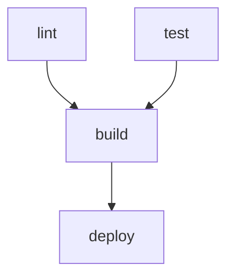

# SYKLI

**CI in your language. No YAML. No DSL. Just code.**

[](LICENSE)
[](https://elixir-lang.org)
[](CHANGELOG.md)

A CI orchestrator that lets you define pipelines in Go, Rust, TypeScript, or Elixir. Your pipeline is a real program that outputs a task graph, which Sykli executes in parallel.

---

## Philosophy: Local First

**We start local.** Sykli runs on your laptop first, not in a CI server you can't debug.

```
┌─────────────────────────────────────────────────────────────────┐
│                    LOCAL FIRST                                   │
├─────────────────────────────────────────────────────────────────┤
│                                                                  │
│   1. Write sykli.go on your laptop                               │
│   2. Run `sykli` - see it work (or fail) immediately             │
│   3. Fix issues locally, not via git push + wait + read logs     │
│   4. When ready, same pipeline runs in CI                        │
│                                                                  │
│   Your laptop IS your CI server. CI is just another node.        │
│                                                                  │
└─────────────────────────────────────────────────────────────────┘
```

This release (v0.2.0) focuses on **local execution with Docker containers**. Kubernetes and remote execution come next, but the foundation is solid: if it works on your machine, it works everywhere.

---

## What's New in v0.2.0

| Feature | Description |
|---------|-------------|
| **`sykli init`** | Auto-detect language and create sykli file |
| **`sykli validate`** | Check for errors without running |
| **`sykli delta`** | Run only tasks affected by git changes |
| **`sykli watch`** | Re-run affected tasks on file changes |
| **`sykli graph`** | Visualize your pipeline as Mermaid/DOT diagram |
| **`sykli --mesh`** | Distribute tasks across connected BEAM nodes |
| **Status graph** | See pipeline status after each run: `lint ✓, test ✓ → build ✗` |
| **Error highlighting** | Key errors extracted and highlighted in output |
| **Templates** | DRY - define container config once, reuse everywhere |
| **Parallel/Chain** | Compose tasks into concurrent groups or sequences |
| **Artifact passing** | Pass outputs between tasks with `InputFrom` |

See [CHANGELOG.md](CHANGELOG.md) for full details.

---

## How It Works

```
sykli.go  ──run──▶  JSON task graph  ──▶  parallel execution
   SDK                  stdout              Elixir engine
```

1. Sykli detects your SDK file (`sykli.go`, `sykli.rs`, `sykli.ts`, or `sykli.exs`)
2. Runs it with `--emit` to get a JSON task graph
3. Executes tasks in parallel by dependency level
4. Caches results based on input file hashes

---

## Quick Start

```bash
# Install
curl -fsSL https://raw.githubusercontent.com/yairfalse/sykli/main/install.sh | bash

# Create sykli.go
cat > sykli.go << 'EOF'
package main

import sykli "github.com/yairfalse/sykli/sdk/go"

func main() {
    s := sykli.New()
    s.Task("test").Run("go test ./...")
    s.Task("build").Run("go build -o app").After("test")
    s.Emit()
}
EOF

# Run
sykli
```

Output:
```
── Level with 1 task(s) ──
▶ test  go test ./...
✓ test  42ms

── Level with 1 task(s) ──
▶ build  go build -o app
✓ build  1.2s

test ✓ → build ✓

✓ All tasks completed in 1.3s
```

---

## CLI Commands

### `sykli` - Run Pipeline

```bash
sykli                    # Run all tasks
sykli --filter=test      # Run only tasks matching "test"
sykli --mesh             # Distribute across connected nodes
```

### `sykli init` - Create Sykli File

Auto-detects your project language and creates the appropriate sykli file.

```bash
sykli init               # Auto-detect (go.mod → sykli.go, Cargo.toml → sykli.rs, package.json → sykli.ts)
sykli init --go          # Force Go
sykli init --rust        # Force Rust
sykli init --typescript  # Force TypeScript
sykli init --elixir      # Force Elixir
```

### `sykli validate` - Check Without Running

Validate your pipeline for errors without executing tasks.

```bash
sykli validate           # Check for cycles, missing deps, duplicates
sykli validate --json    # Output as JSON for tooling
```

Output:
```
Valid

Tasks: lint, test, build, deploy
```

### `sykli delta` - Affected Tasks Only

Only run tasks affected by your git changes. Perfect for large monorepos.

```bash
sykli delta              # Compare against HEAD (uncommitted changes)
sykli delta --from=main  # Compare against main branch
sykli delta --from=HEAD~3 # Compare against 3 commits ago
```

Output:
```
Changed files (3):
  src/api/handler.go
  src/api/handler_test.go
  go.mod

Affected tasks:
  ● test       (direct: src/api/*.go changed)
  ● build      (depends on: test)
  ○ lint       (not affected)
  ○ deploy     (not affected)

Running 2 affected tasks...
```

### `sykli graph` - Visualize Pipeline

See your pipeline as a dependency graph.

```bash
sykli graph              # Output Mermaid diagram
sykli graph --format=dot # Output Graphviz DOT
```

Output (Mermaid):


### `sykli watch` - Live Reload

Watch for file changes and re-run affected tasks automatically.

```bash
sykli watch              # Watch current directory
sykli watch --from=main  # Compare against main branch
```

### `sykli --mesh` - Distributed Execution

Distribute tasks across connected BEAM nodes on your network.

```bash
# Start daemon on each machine
sykli daemon start

# Run with mesh distribution
sykli --mesh
```

Output:
```
Running with mesh executor
Dispatching build to worker@192.168.1.42
✓ test (local)
✓ build (worker@192.168.1.42)
```

### `sykli report` - Last Run Summary

Show detailed results from the last run.

```bash
sykli report             # Show last run
sykli report --last-good # Show last passing run
sykli report --json      # Output as JSON
```

### `sykli history` - Run History

List recent pipeline runs.

```bash
sykli history            # Last 10 runs
sykli history --limit=5  # Last 5 runs
```

Output:
```
Recent runs:
  ✓ 2026-01-01 22:30:15  a5bce75  4/4
  ✗ 2026-01-01 21:15:42  b1f0be0  3/4
  ✓ 2026-01-01 20:00:01  17cb0ff  4/4
```

### `sykli cache` - Cache Management

```bash
sykli cache stats        # Show cache statistics
sykli cache clean        # Clear all cached results
sykli cache clean --older-than 7d  # Clean old entries
```

---

## SDK Examples

### Basic Tasks

```go
s := sykli.New()
s.Task("test").Run("go test ./...")
s.Task("lint").Run("go vet ./...")
s.Task("build").Run("go build -o app").After("test", "lint")
s.Emit()
```

`test` and `lint` run in parallel. `build` waits for both.

### Caching

```go
s.Task("test").
    Run("go test ./...").
    Inputs("**/*.go", "go.mod")
```

If input files haven't changed, task is skipped:
```
⊙ test  CACHED
```

### Matrix Builds

```go
s.Task("test").
    Run("go test ./...").
    Matrix("go_version", "1.21", "1.22", "1.23")
```

Expands to `test[go_version=1.21]`, `test[go_version=1.22]`, `test[go_version=1.23]`.

### Templates (v0.2.0)

Define container configuration once, reuse everywhere. No more copy-paste.

```go
s := sykli.New()
src := s.Dir(".")
cache := s.Cache("go-mod")

// Define template once
golang := s.Template("golang").
    Container("golang:1.21").
    Mount(src, "/src").
    MountCache(cache, "/go/pkg/mod").
    Workdir("/src")

// Reuse everywhere - clean and DRY
s.Task("test").From(golang).Run("go test ./...")
s.Task("lint").From(golang).Run("go vet ./...")
s.Task("build").From(golang).Run("go build -o app")
```

### Parallel Groups (v0.2.0)

Run multiple tasks concurrently as a named group.

```go
// These three tasks run in parallel
checks := s.Parallel("checks",
    s.Task("lint").From(golang).Run("go vet ./..."),
    s.Task("fmt").From(golang).Run("gofmt -l ."),
    s.Task("test").From(golang).Run("go test ./..."),
)

// Build waits for all checks to complete
s.Task("build").From(golang).Run("go build").After(checks)
```

### Chain (v0.2.0)

Run tasks in sequence, each depending on the previous.

```go
// deploy runs after build, build runs after test
s.Chain(
    s.Task("test").Run("go test ./..."),
    s.Task("build").Run("go build -o app"),
    s.Task("deploy").Run("./deploy.sh"),
)
```

### Artifact Passing (v0.2.0)

Pass outputs from one task to another.

```go
// Build produces an artifact
build := s.Task("build").
    From(golang).
    Run("go build -o /out/app").
    Output("binary", "/out/app")

// Deploy consumes it
s.Task("deploy").
    Run("./deploy.sh /app/bin").
    InputFrom(build, "binary", "/app/bin")
```

### Containers

```go
s := sykli.New()
src := s.Dir(".")
cache := s.Cache("go-mod")

s.Task("test").
    Container("golang:1.21").
    Mount(src, "/src").
    MountCache(cache, "/go/pkg/mod").
    Workdir("/src").
    Run("go test ./...")
s.Emit()
```

### Retry & Timeout

```go
s.Task("integration").
    Run("./integration-tests.sh").
    Retry(3).
    Timeout(300)
```

### Conditional Execution

```go
s.Task("deploy").
    Run("./deploy.sh").
    When("branch == 'main'").
    Secret("DEPLOY_TOKEN")
```

### Type-Safe Conditions

Instead of error-prone strings, use the condition builder for compile-time safety:

```go
// Go
s.Task("deploy").
    Run("./deploy.sh").
    WhenCond(sykli.Branch("main").Or(sykli.HasTag()))

// Rust
p.task("deploy")
    .run("./deploy.sh")
    .when_cond(Condition::branch("main").or(Condition::has_tag()));
```

```elixir
# Elixir
alias Sykli.Condition

task "deploy" do
  run "./deploy.sh"
  when_cond Condition.branch("main") |> Condition.or_cond(Condition.has_tag())
end
```

Available conditions: `Branch("main")`, `Tag("v*")`, `HasTag()`, `Event("push")`, `InCI()`, combined with `And()`, `Or()`, `Not()`.

### Typed Secret References

Explicit secret sources with validation:

```go
// Go
s.Task("deploy").
    Run("./deploy.sh").
    SecretFrom("GITHUB_TOKEN", sykli.SecretFromEnv("GH_TOKEN")).
    SecretFrom("DB_PASS", sykli.SecretFromVault("secret/data/db#password"))

// Rust
p.task("deploy")
    .run("./deploy.sh")
    .secret_from("GITHUB_TOKEN", SecretRef::from_env("GH_TOKEN"))
    .secret_from("DB_PASS", SecretRef::from_vault("secret/data/db#password"));
```

```elixir
# Elixir
alias Sykli.SecretRef

task "deploy" do
  run "./deploy.sh"
  secret_from "GITHUB_TOKEN", SecretRef.from_env("GH_TOKEN")
  secret_from "DB_PASS", SecretRef.from_vault("secret/data/db#password")
end
```

Sources: `from_env()`, `from_file()`, `from_vault()`. Vault paths are validated for correct `path#field` format.

### Per-Task Target Override

Run different tasks on different targets in the same pipeline:

```go
s.Task("test").Run("mix test").Target("local")
s.Task("deploy").Run("kubectl apply").Target("k8s")
```

### Kubernetes Options

Full K8s configuration with helpful validation:

```go
// Go
s.Task("build").
    Run("cargo build").
    K8s(sykli.K8sTaskOptions{
        Resources: sykli.K8sResources{Memory: "4Gi", CPU: "2"},
        GPU: 1,
        NodeSelector: map[string]string{"gpu": "true"},
    })
```

```elixir
# Elixir
alias Sykli.K8s

task "build" do
  run "cargo build"
  k8s K8s.options()
       |> K8s.memory("4Gi")
       |> K8s.cpu("2")
       |> K8s.gpu(1)
       |> K8s.node_selector("gpu", "true")
end
```

**Validation with helpful suggestions:**
```
# If you accidentally write "4gb" instead of "4Gi":
k8s.resources.memory: invalid format '4gb' (did you mean 'Gi'?)
```

### Explain / Dry-Run Mode

Preview what would run without executing:

```go
// Go
s.Explain(os.Stdout, &sykli.ExplainContext{Branch: "feature/foo"})
```

```elixir
# Elixir
Sykli.Explain.explain(pipeline, %Sykli.Explain{branch: "feature/foo"})
```

Output:
```
Pipeline Execution Plan
=======================
1. test
   Command: mix test

2. build (after: test)
   Command: mix compile

3. deploy (after: build) [SKIPPED: branch is 'feature/foo', not 'main']
   Command: ./deploy.sh
   Condition: branch == 'main'
```

### Helpful Error Messages

All SDKs now provide intelligent error suggestions:

**Task name typos:**
```
task "deploy" depends on unknown task "buld" (did you mean "build"?)
```

**K8s resource format:**
```
k8s.resources.memory: invalid format '512mb' (did you mean 'Mi'?)
```

**Vault path format:**
```
task "deploy": invalid Vault path "secret/data/db"
Expected format: "path/to/secret#field" (e.g., "secret/data/db#password")
```

---

## All Four SDKs

### Go

```go
package main

import sykli "github.com/yairfalse/sykli/sdk/go"

func main() {
    s := sykli.New()
    s.Task("test").Run("go test ./...")
    s.Task("build").Run("go build -o app").After("test")
    s.Emit()
}
```

### Rust

```rust
use sykli::Pipeline;

fn main() {
    let mut p = Pipeline::new();
    p.task("test").run("cargo test");
    p.task("build").run("cargo build --release").after(&["test"]);
    p.emit();
}
```

### TypeScript

```typescript
import { Pipeline, branch, ValidationError } from 'sykli';

const p = new Pipeline();

p.task('test').run('npm test').inputs('**/*.ts');
p.task('build').run('npm run build').after('test');
p.task('deploy').run('./deploy.sh').after('build').whenCond(branch('main'));

// Dry-run visualization
console.log(p.explain({ branch: 'feature/foo' }));

p.emit();
```

### Elixir

```elixir
Mix.install([{:sykli, path: "sdk/elixir"}])

defmodule Pipeline do
  use Sykli

  pipeline do
    task "test" do
      run "mix test"
      inputs ["**/*.ex", "mix.exs"]
    end

    task "build" do
      run "mix compile"
      after_ ["test"]
    end
  end
end
```

---

## Features

### v0.2.0 (Current)

| Feature | Status |
|---------|--------|
| **SDKs** | |
| Go SDK | ✅ |
| Rust SDK | ✅ |
| TypeScript SDK | ✅ NEW |
| Elixir SDK | ✅ |
| **Execution** | |
| Parallel execution | ✅ |
| Content-addressed caching | ✅ |
| Mesh distribution (`--mesh`) | ✅ NEW |
| Cycle detection | ✅ |
| Retry & timeout | ✅ |
| **Composition** | |
| Templates | ✅ |
| Parallel groups | ✅ |
| Chain combinator | ✅ |
| Artifact passing | ✅ |
| Matrix builds | ✅ |
| **CLI** | |
| `sykli init` | ✅ NEW |
| `sykli validate` | ✅ NEW |
| `sykli delta` | ✅ |
| `sykli watch` | ✅ NEW |
| `sykli graph` | ✅ |
| `sykli report` / `history` | ✅ NEW |
| Status graph after runs | ✅ NEW |
| Error highlighting | ✅ NEW |
| **Targets** | |
| Local (Docker) | ✅ |
| Container tasks | ✅ |
| K8s execution (native Jobs) | ✅ |
| K8s options with validation | ✅ |
| **Integrations** | |
| GitHub status API | ✅ |
| Remote cache | 🚧 v0.3.0 |

---

## Architecture

```
┌─────────────┐     ┌──────────────┐     ┌────────────┐
│  sykli.go   │────▶│  JSON Graph  │────▶│   Engine   │
│    (SDK)    │     │   (stdout)   │     │  (Elixir)  │
└─────────────┘     └──────────────┘     └────────────┘
                                               │
                    ┌──────────────────────────┼──────────────────────────┐
                    ▼                          ▼                          ▼
              ┌──────────┐              ┌──────────┐              ┌──────────┐
              │  lint    │              │   test   │              │  build   │
              │ (level 0)│              │ (level 0)│              │ (level 1)│
              └──────────┘              └──────────┘              └──────────┘
```

**Why Elixir?** The same OTP code that runs locally can distribute across a cluster. Local and remote execution are the same system at different scales.

---

## Project Structure

```
sykli/
├── core/                   # Elixir engine
│   └── lib/sykli/
│       ├── detector.ex     # Finds SDK file, runs --emit
│       ├── graph.ex        # Parses JSON, topological sort
│       ├── executor.ex     # Parallel execution
│       ├── cache.ex        # Content-addressed caching
│       └── cli.ex          # CLI interface
├── sdk/
│   ├── go/                 # Go SDK (~1000 lines)
│   ├── rust/               # Rust SDK (~1500 lines)
│   ├── typescript/         # TypeScript SDK (~1300 lines)
│   └── elixir/             # Elixir SDK
└── examples/               # Working examples
```

---

## Development

```bash
# Build escript binary
cd core && mix escript.build

# Run tests
mix test

# Run from source
mix run -e 'Sykli.run(".")'
```

---

## Naming

**Sykli** (Finnish: "cycle") - Part of a Finnish tool naming theme:
- **SYKLI** (cycle) - CI orchestrator
- **NOPEA** (fast) - GitOps controller
- **KULTA** (gold) - Progressive delivery
- **RAUTA** (iron) - Gateway API controller

---

## Roadmap

**v0.2.0** (Current) - DX & Distribution
- ✅ `sykli init` / `sykli validate`
- ✅ `sykli watch` - file watcher
- ✅ `sykli report` / `sykli history`
- ✅ `--mesh` distributed execution
- ✅ K8s target (native Jobs, no CRDs)
- ✅ Status graph and error highlighting
- ✅ Templates, Parallel, Chain composition

**v0.3.0** - Remote Cache & Polish
- 🚧 Remote cache (S3/GCS)
- 🚧 Cache garbage collection
- 🚧 K8s service mesh integration

**v0.4.0** - Cloud & Observability
- 🔮 `sykli connect` - hosted dashboard
- 🔮 Hot config push
- 🔮 Live process observation

See [docs/adr/](docs/adr/) for detailed architectural decisions.

---

## License

MIT

---

**Built in Berlin. Powered by BEAM. No YAML was harmed.**
